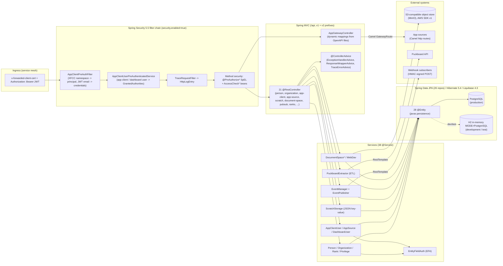
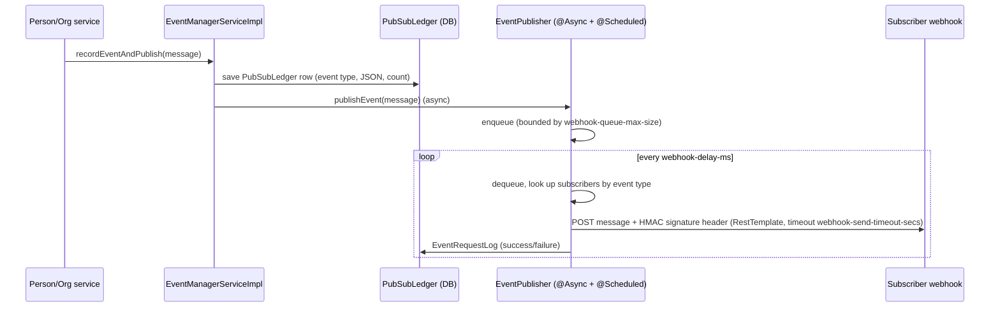

# 01 — Architecture (current state)

Head commit inspected: `7b22ec561c2625ff1200156d058fcdd0ff022e69`. Evidence and confidence conventions are defined in `00-inventory.md`. Paths below are relative to the repository root; `src/main/java/mil/tron/commonapi/` is abbreviated to `…/commonapi/` in prose but written in full in evidence cells.

## 1. Component map

Confidence: High for the boxes and edges (each is traced below); Medium for the claim that every controller only reaches persistence through a service (three controllers inject repositories or non-service beans directly — `RankController` is service-only, but `AppGatewayController` and the document-space controllers wire extra collaborators; see §2.1).

## 2. Request path: controller → service → repository → entity

### 2.1 Layering as implemented

| Layer | What is there / convention observed | Evidence | Confidence |
|---|---|---|---|
| Controllers | 21 `@RestController` + `AppGatewayController` (`@Controller`) + `RootPathController`; class-level `@RequestMapping({"${api-prefix.v1}/…","${api-prefix.v2}/…"})` on 12 controllers; the rest put both prefixes on each method | `src/main/java/mil/tron/commonapi/controller/ranks/RankController.java:24-26` (class-level), `src/main/java/mil/tron/commonapi/controller/DashboardUserController.java:26-151` (per-method) | High |
| Response envelope | v2 collection endpoints annotated `@WrappedEnvelopeResponse`; `ResponseWrapperAdvice` wraps the body | `src/main/java/mil/tron/commonapi/controller/advice/ResponseWrapperAdvice.java:33` | High |
| Error shape | `ExceptionHandlerAdvice` maps domain exceptions to `ExceptionResponse` | `src/main/java/mil/tron/commonapi/controller/advice/ExceptionHandlerAdvice.java:24` | High |
| Services | 38 `@Service`/`@Component`; interface + `Impl` pairs (e.g. `RankService`/`RankServiceImpl`) | `src/main/java/mil/tron/commonapi/service/ranks/RankServiceImpl.java:16` | High |
| Repositories | 26 Spring Data interfaces; `JpaSpecificationExecutor` + `SpecificationBuilder` for filter endpoints | `src/main/java/mil/tron/commonapi/repository/ranks/RankRepository.java:12`, `src/main/java/mil/tron/commonapi/repository/filter/SpecificationBuilder.java` | High |
| Entities | 28 `@Entity`, UUID ids, Lombok builders, `javax.persistence` | `src/main/java/mil/tron/commonapi/entity/ranks/Rank.java:17-19` | High |
| Mapping | `ModelMapper` 2.3.0 (`pom.xml:180-184`) via `DtoMapper`; JSON Patch (`json-patch` 1.12, `pom.xml:204-208`) for `PATCH` endpoints | `pom.xml:180-184,204-208` | High |

Example slice (used again in `03-slice-candidates.md`): `RankController` (`…/controller/ranks/RankController.java:24-84`, 4 GET handlers) → `RankServiceImpl` (`…/service/ranks/RankServiceImpl.java:16`) → `RankRepository` (`…/repository/ranks/RankRepository.java:12`) → `Rank` entity (`…/entity/ranks/Rank.java:17`) → table seeded by Liquibase CSVs (`src/main/resources/db/seed.1.0.40/`, `00-inventory.md` §4.3).

### 2.2 Cross-cutting behaviour that a modernization must keep

| Behaviour | Where | Evidence |
|---|---|---|
| Entity Field Authorization (EFA): protected fields on Person/Organization can only be changed by callers with the matching privilege; toggled by `efa-enabled` | `EntityFieldAuthServiceImpl` | `src/main/java/mil/tron/commonapi/service/fieldauth/EntityFieldAuthServiceImpl.java:34,47`; `src/main/resources/application.properties:119` |
| HTTP trace persisted to DB (`HttpLogEntry`) by `TraceRequestFilter`, queried via `HttpLogsController` | security chain | `src/main/java/mil/tron/commonapi/security/WebSecurityConfig.java:62`, `src/main/java/mil/tron/commonapi/controller/HttpLogsController.java:29` |
| Caching (Caffeine) behind `caching.enabled` | `CacheConfig` | `src/main/java/mil/tron/commonapi/CacheConfig.java`; `src/main/resources/application.properties:102-106` |
| Metrics: custom meter registry persisting `MeterValue` rows, gateway hit counting behind `metrics.*` flags | `CustomMeterRegistry`, `MetricsConfig` | `src/main/java/mil/tron/commonapi/CustomMeterRegistry.java`, `src/main/resources/application-development.properties:28-31` |

Confidence: High.

## 3. Security filter chain and authorization model

### 3.1 Filter chain (only when `security.enabled=true`)

| Step | Evidence | Behaviour |
|---|---|---|
| Config class | `src/main/java/mil/tron/commonapi/security/WebSecurityConfig.java:19-22` | `@ConditionalOnProperty(security.enabled=true)`, extends **`WebSecurityConfigurerAdapter`** (removed in Spring Security 6) |
| Disabled variant | `src/main/java/mil/tron/commonapi/security/WebSecurityConfigDisabled.java:10-11` | `security.enabled=false` → permit-all adapter; this is what the test profile loads (`src/main/resources/application-test.properties:16`) |
| Pre-auth filter | `WebSecurityConfig.java:43`, `src/main/java/mil/tron/commonapi/security/AppClientPreAuthFilter.java:14-45` | `AbstractPreAuthenticatedProcessingFilter`: principal = namespace parsed from the `x-forwarded-client-cert` URI SAN (`:16-27`); credentials = `email` claim of the bearer JWT **decoded without signature verification** (`JWT.decode`, `:29-42`) |
| Path rules | `WebSecurityConfig.java:45-53` | `/`, `/api-docs**` permitAll; `/actuator/httptrace` denyAll; `/actuator/health/**` → `DASHBOARD_USER`; `/actuator/logfile`, `/puckboard/**` → `DASHBOARD_ADMIN`; anything else `authenticated()` |
| Session/CSRF | `WebSecurityConfig.java:57-60` | CSRF disabled, `SessionCreationPolicy.STATELESS` |
| Trace filter | `WebSecurityConfig.java:62` | `TraceRequestFilter` before `ExceptionTranslationFilter` |
| Headers | `WebSecurityConfig.java:64` | Content-Security-Policy string with an allow-listed wildcard domain (hard-coded) |
| Method security | `src/main/java/mil/tron/commonapi/security/MethodSecurityConfig.java:18-21` | `@EnableGlobalMethodSecurity(prePostEnabled, securedEnabled, jsr250Enabled, order=1)` — replaced by `@EnableMethodSecurity` in Security 6 |

### 3.2 Identity resolution (`AppClientUserPreAuthenticatedService`)

`src/main/java/mil/tron/commonapi/service/AppClientUserPreAuthenticatedService.java:36-110`:

1. If the XFCC namespace equals the platform's own app name **and** a JWT email is present → look up `DashboardUser` by email (`:80-90`); authorities = that user's `Privilege` names (e.g. `DASHBOARD_ADMIN`, `DASHBOARD_USER`). An unknown email yields a `User` with **no** authorities (`:90`), so SSO users who are not dashboard users are authenticated but unprivileged.
2. Otherwise → look up `AppClientUser` by namespace name (`:99`); authorities = the app client's privileges + one `APP_CLIENT` authority (`:109`) + one synthetic authority per granted app-source endpoint (`:179-190`, built from app-source path, endpoint path and HTTP method).
3. Special case: a request from the `digitize` host app carrying a `digitize-id` header is re-mapped to a `digitize-<uuid>` app client registered in scratch storage, with the requester's email checked against the scratch app's user list (`:47-59,113-156`).

### 3.3 Authorization expressions

| Mechanism | Evidence | Note |
|---|---|---|
| Meta-annotations `@PreAuthorize*` (`annotation/security/`, 23 files in `annotation/`) | `src/main/java/mil/tron/commonapi/annotation/security/PreAuthorizeDashboardAdmin.java:9-10` (`hasAuthority('DASHBOARD_ADMIN')`) | Simple authority checks |
| Gateway check `@PreAuthorizeGateway` → `@accessCheck.check(#request)` | `src/main/java/mil/tron/commonapi/security/AccessCheckImpl.java:22-94` | Resolves the request's mapping and compares to the caller's synthetic endpoint authorities; falls back to "app-client developer" aggregation |
| Resource-scoped checks | `AccessCheckAppSourceImpl`, `AccessCheckDocumentSpaceImpl`, `AccessCheckEventRequestLogImpl` (`src/main/java/mil/tron/commonapi/security/`) | SpEL beans referenced from controller annotations; PRs #1–#3 change exactly these expressions |
| Scratch-storage ACLs | `ScratchStorageServiceImpl` (`src/main/java/mil/tron/commonapi/service/scratch/`) | Per-app key/user privileges stored in `ScratchStorageAppUserPriv`; PR #5 hardens null handling |
| Stacked annotations | e.g. `@PreAuthorizeOnlySSO` + a second `@PreAuthorize` on the same method in `DocumentSpaceController` | PR #4 reports Security 6 rejects two `@PreAuthorize` on one method → expressions had to be merged by hand |

Confidence: High for mechanics; **Medium for behavioural completeness** — the authorization matrix (who may call which of the 193 handlers) is spread across ~60 annotations and 4 SpEL beans and is only exercised with security enabled in 10 integration classes (`00-inventory.md` §6). Raise by generating the matrix from annotations and writing security-enabled characterization tests (see `03-slice-candidates.md`).

## 4. Document space and file storage

| Aspect | Evidence | Finding |
|---|---|---|
| Activation | `src/main/java/mil/tron/commonapi/annotation/minio/IfMinioEnabledOnIL4OrDevLocal.java:15` | The whole feature (config, 3 controllers, 3 services) exists only when `minio.enabled` and (enclave `IL4` or profile `development`/`local`) |
| Client | `src/main/java/mil/tron/commonapi/DocumentSpaceConfig.java:37-62` | AWS SDK v1 `AmazonS3` with custom endpoint + path-style access; `TransferManager` for multipart |
| Metadata in DB | `src/main/java/mil/tron/commonapi/entity/documentspace/DocumentSpaceFileSystemEntry.java`, `DocumentSpace.java`, `DocumentSpacePrivilege.java`, `DocumentSpaceUserCollection.java`, `metadata/FileSystemEntryMetadata.java` | Folder tree, per-space privileges, favourites and per-entry metadata live in PostgreSQL; **object bytes live in S3**. Two sources of truth that must move together |
| Modification propagation | `src/main/java/mil/tron/commonapi/service/documentspace/DocumentSpaceFileSystemServiceImpl.java:792-800` | `propagateModificationStateToAncestors` uses `.orElse(new Date())` — wall-clock dependent (see failing test, `02-risk-register.md` R-08) |
| Surfaces | `controller/documentspace/DocumentSpaceController.java:55` (43 handlers), `DocumentSpaceMobileController.java:44` (2), `DocumentSpaceWebDavController.java:28` (1 catch-all `@RequestMapping` implementing WebDAV verbs in `service/webdav/WebDavServiceImpl.java`) | Largest single API surface in the service |
| Upload limit | `src/main/resources/application.properties:131` | 40,000 MB multipart limit |
| Tests | `io.findify:s3mock_2.13` (`pom.xml:45-50`) | Integration tests start an in-process S3 mock — **not** "no external services" in spirit, and the mock is archived upstream |

Confidence: High.

## 5. ETL (Puckboard) and event publishing

### 5.1 Puckboard ETL

`PuckboardEtlController` (`src/main/java/mil/tron/commonapi/controller/puckboard/PuckboardEtlController.java:21-22,51-111`) exposes admin-only endpoints that pull organisations/people from a Puckboard API (`RestTemplate`, base URLs `src/main/resources/application.properties:45-46`) and upsert them through `PuckboardExtractorServiceImpl` (`src/main/java/mil/tron/commonapi/service/puckboard/PuckboardExtractorServiceImpl.java`) into `Person`/`Organization`. Rank mapping depends on the seeded `Rank` table (PR #6 fixes unknown ids). The Puckboard OpenAPI definition also ships as an app source (`src/main/resources/appsourceapis/puckboard.yml`). Confidence: High.

### 5.2 Event publishing (pub/sub webhooks)

| Evidence | Finding |
|---|---|
| `src/main/java/mil/tron/commonapi/pubsub/EventManagerServiceImpl.java:51-91` | Ledger row written **before** publish; ledger is the replay source (`SubscriberController` replay endpoints, `src/main/java/mil/tron/commonapi/controller/pubsub/SubscriberController.java:49-282`) — replay is read-only: callers fetch ledger rows; no webhook redelivery is triggered |
| `src/main/java/mil/tron/commonapi/pubsub/EventPublisher.java:58-68,95-100,144-145,200-218` | `ConcurrentLinkedQueue` in memory (lost on restart), `@Async`, `@Scheduled(fixedDelayString)`, HMAC over the body with the subscriber's secret in header `${signature-header}` (`:55-56,216`), `RestTemplate` POST |
| `src/main/resources/application.properties:109-116` | 50 ms delay, 5 s timeout, 1,000,000 max queue |
| `src/main/java/mil/tron/commonapi/entity/pubsub/Subscriber.java`, `…/entity/pubsub/log/EventRequestLog.java:24-26` | Subscriber address/secret/event type; per-delivery log |

Confidence: High. The webhook delivery path needs a network listener; in tests it is exercised with `MockRestServiceServer`/mocked `RestTemplate` (see `03-slice-candidates.md`).

## 6. App-source gateway (Apache Camel)

| Step | Evidence |
|---|---|
| At startup `AppSourceEndpointsBuilder` reads `appsource.definition-file` (`src/main/resources/appsourceapis/appSourceConfig.json`; test variant `src/test/resources/appsourceapis/appSourceConfig.test.json`) and each referenced OpenAPI YAML | `src/main/java/mil/tron/commonapi/appgateway/AppSourceEndpointsBuilder.java:66-118` |
| For every path/operation it registers a Spring MVC `RequestMappingInfo` pointing at `AppGatewayController.handleCachedRequests` (GET) or `handleRequests` (other verbs), and persists `AppSource`/`AppEndpoint` rows | `AppSourceEndpointsBuilder.java:121-192` (mappings at `:162-179`) |
| `AppGatewayRouteBuilder` adds one Camel `GatewayRoute` per app-source path, which proxies to the configured upstream URL via `camel-http` | `src/main/java/mil/tron/commonapi/appgateway/AppGatewayRouteBuilder.java:20-36`, `src/main/java/mil/tron/commonapi/appgateway/GatewayRoute.java` |
| Authorization uses `@PreAuthorizeGateway` → `AccessCheckImpl.check` against `AppEndpointPriv` grants | `src/main/java/mil/tron/commonapi/security/AccessCheckImpl.java:33-94` |
| Health of each app source is polled by an `AppSourceHealthIndicator` registered per source | `src/main/java/mil/tron/commonapi/health/AppSourceHealthIndicator.java:32,150-185` |

Consequence for modernization: the REST surface is partly **data-driven at runtime**; OpenAPI-based contract comparison must include the gateway-registered paths. Confidence: High.

## 7. External interfaces

| Interface | Direction | Protocol / contract | Evidence |
|---|---|---|---|
| REST API v1/v2 under `/api` | inbound | JSON; OpenAPI generated by springdoc 1.5 at `/api/api-docs` (grouped, `application.properties:81`) | `src/main/resources/application.properties:1-3,18-21,81` |
| WebDAV under `/v2/dav` | inbound | WebDAV verbs over the document space | `src/main/java/mil/tron/commonapi/controller/documentspace/DocumentSpaceWebDavController.java:28` |
| Actuator `health`, `logfile`, (`httptrace` denied at HTTP, `metrics` in dev) | inbound | Boot 2.5 Actuator JSON | `application.properties:52-71`, `application-development.properties:34-37` |
| Identity headers | inbound | `x-forwarded-client-cert` (mesh mTLS SAN), `Authorization: Bearer <JWT>` (unverified `email` claim) | `AppClientPreAuthFilter.java:16,30-31,41` |
| App-source proxying | outbound | HTTP via Camel; upstream URLs from app-source config | `AppSourceEndpointsBuilder.java`, `appsourceapis/*.yml` |
| Puckboard | outbound | HTTP JSON (`RestTemplate`) | `application.properties:45-46` |
| Webhooks | outbound | HTTP POST JSON + HMAC header | `EventPublisher.java:200-218` |
| Object storage | outbound | S3 API v1 SDK, path-style, custom endpoint | `DocumentSpaceConfig.java:47-52` |
| Database | outbound | JDBC PostgreSQL (`sslmode=require` in production) / H2 PostgreSQL mode | `application.properties:14`, `application-production.properties:5`, `application-development.properties:3` |
| CORS | inbound | `origins`, `scratch-origin` allow-lists; Actuator CORS to `localhost:3000` | `application.properties:48-49,63-66` |

Confidence: High.

## 8. Where state lives

| State | Location | Durable? | Evidence | Modernization note |
|---|---|---|---|---|
| Domain data (people, orgs, app clients/sources, privileges, dashboard users, scratch JSON, document-space metadata, KPI/metrics, HTTP trace, pub/sub ledger + logs) | PostgreSQL (prod) / H2 (dev, test) via 28 entities | Yes (prod); in-memory for dev/test | `00-inventory.md` §4 | Schema is Liquibase-owned; **Liquibase changelog table history is state too** |
| Schema history + seed reference data (ranks) | Liquibase `DATABASECHANGELOG` + CSV `loadData` | Yes | `src/main/resources/db/db.changelog-master.xml:8`, `db/changelog/diff-changelog-1.00.002.xml:11-17` | Checksums are computed by Liquibase 4.3.1; upgrading Liquibase changes checksum algorithm (4.x→4.2x/5.x) — validate before cut-over |
| File contents | S3-compatible bucket `minio.bucket-name` | Yes | `DocumentSpaceConfig.java:22-23,31-32`, `application-production.properties:11` | Keys are derived from document-space ids — must not change |
| Outbound webhook queue | JVM heap (`EventPublisher` queue) | **No** — lost on restart; ledger rows survive and can be *pulled* by subscribers via the replay endpoints, but the service does not re-send them | `EventPublisher.java:58-68`, `SubscriberController.java:168-257` | Any rolling restart drops queued events |
| App-source route table + dynamic MVC mappings | JVM (rebuilt at startup from config + DB) | No (derived) | `AppSourceEndpointsBuilder.java:66-118` | Rebuilt deterministically; safe |
| Health snapshots per app source | JVM (`AtomicReference<Health>`) | No | `AppSourceHealthIndicator.java:150-185` | — |
| Caches | Caffeine in JVM when `caching.enabled` | No | `CacheConfig.java` | — |
| Logs | `./logs` file path | Node-local | `application.properties:73` | `LogfileController` serves this file (`src/main/java/mil/tron/commonapi/controller/LogfileController.java:27`) |
| Session | none — stateless | — | `WebSecurityConfig.java:60` | — |

Confidence: High.
